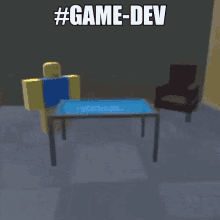

  
	<h1>Játékfejlesztő szakkör a <a src="https://puskas.hu">PTTIT</a>-ben.</h1>
	<!-- gamdev club in PTTIT -->

<h3>Rólunk</h3>

BMSZC Puskás Tivadar Távközlési és Informatikai Technikumi szakkör.

<!-- BMSZC Puskás Tivadar Telecommuntication and Information technology Technical school's club -->

Programozó / játékfejlesztő szakkör

<!-- programming / gamdev afterschool club -->

<h3>Eszközök amiket használunk</h3>
<!-- Tools we use -->

<h3>Social Media / Elérhetőség</h3>
<!-- Social media / Connection -->

    
    
    
		
		

<h5>Goofy gif</h5>

